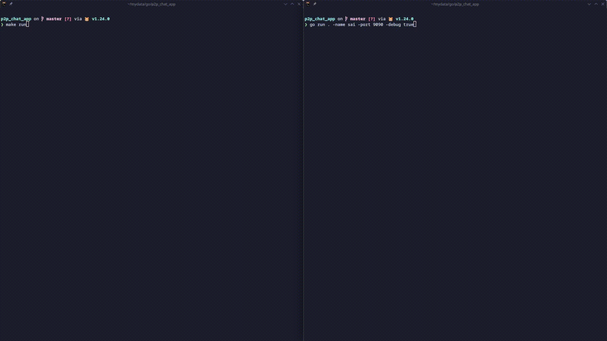

## Peer 2 Peer Chat

Good looking peer to peer chat made with golang.

**Features**
- Automatic Peer Discovery
- Connect with everyone in the current local address
- Have multiple Peers from the same device (Shared Port)
- Good Terminal Design

**Demo**



**How To Install**

Clone the Repo
```sh
git clone https://github.com/sairash/p2p_chat_app.git
```
Go to the directory
```sh
cd p2p_chat_app
```
Use Make to run the application
```sh
make run
```
Or Build and run the application
```sh
go build -o p2p
```
```sh
./p2p  -name sai -port 8080 -local false -debug false
```
Repeat the same thing in another terminal or computer and enjoy talking peer to peer.